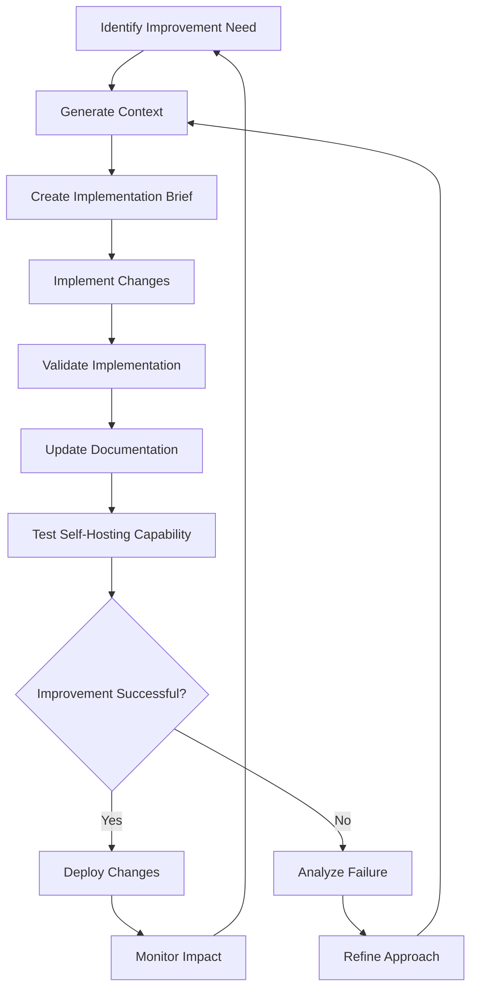

# Self-Hosting Strategy for GuardianAI MVP

**Document Purpose**: Define how Claude will use GuardianAI to improve GuardianAI itself
**Audience**: Claude (implementation agent) and project stakeholders
**Focus**: Bootstrap methodology and iterative self-improvement

## Self-Hosting Philosophy

The ultimate test of GuardianAI MVP is whether Claude can effectively use it to improve the tool itself. This creates a virtuous cycle:

1. **Build Minimal Tool** → Claude has basic capabilities
2. **Use Tool on Itself** → Claude identifies what's missing/broken
3. **Improve Tool Using Tool** → Claude generates better code with tool assistance
4. **Repeat** → Tool continuously improves through self-application

This approach ensures the tool genuinely solves real problems rather than hypothetical ones.

## Self-Hosting Phases

### Phase 1: Initial Self-Analysis

**Goal**: Understand the GuardianAI codebase using GuardianAI itself

#### Step 1.1: Project Indexing
```bash
# Claude runs this command
guardian-ai index ./src --config ./guardian-ai.config.yaml
```

**Expected Outcome**:
- Complete project index of GuardianAI MVP codebase
- Identification of code patterns used
- Dependency graph showing service relationships
- Architecture overview of the tool itself

**Success Criteria**:
- All TypeScript files are properly parsed
- Service dependencies are correctly identified
- Pattern detection finds at least 5 consistent patterns
- No critical parsing errors

#### Step 1.2: Architecture Documentation
```bash
# Claude analyzes the architecture
guardian-ai query "What is the overall architecture of this project?"
guardian-ai query "How do the services interact with each other?"
guardian-ai query "What patterns are used for error handling?"
```

**Expected Outcome**:
- Clear understanding of the 3-layer architecture
- Service interaction patterns
- Error handling approaches
- Configuration management approach

#### Step 1.3: Pattern Validation
```bash
# Claude validates that the tool recognizes its own patterns
guardian-ai query "Show me examples of the Service Pattern"
guardian-ai query "What files implement the EventBus pattern?"
```

**Expected Outcome**:
- Tool correctly identifies its own architectural patterns
- Provides accurate examples from its own codebase
- Demonstrates pattern recognition is working

### Phase 2: Self-Improvement Tasks

**Goal**: Use GuardianAI to implement improvements to GuardianAI

#### Task 2.1: Enhanced Error Handling
```bash
# Claude defines a self-improvement task
guardian-ai context "Improve error handling in IndexingService with more specific error types and better recovery strategies"
```

**Implementation Process**:
1. GuardianAI analyzes the IndexingService
2. Identifies current error handling patterns
3. Suggests improvements based on best practices
4. Claude implements changes following the brief
5. Validates implementation against the brief

**Expected Changes**:
- More specific error types (ParseError, FileAccessError, etc.)
- Better error recovery strategies
- Enhanced error context information
- Improved logging for debugging

#### Task 2.2: Performance Optimization
```bash
# Claude targets performance improvements
guardian-ai context "Optimize pattern matching performance by implementing caching and parallel processing"
```

**Implementation Process**:
1. GuardianAI identifies performance bottlenecks
2. Suggests optimization strategies
3. Provides examples of caching patterns from codebase
4. Claude implements optimizations
5. Validates performance improvements

**Expected Changes**:
- Caching layer for parsed files
- Parallel processing for file analysis
- Debounced pattern updates
- Memory usage optimization

#### Task 2.3: Enhanced Context Generation
```bash
# Claude improves the core context compilation
guardian-ai context "Enhance context compilation to better identify related files and provide more accurate relevance scoring"
```

**Implementation Process**:
1. GuardianAI analyzes current context compilation logic
2. Identifies areas for improvement
3. Suggests algorithmic enhancements
4. Claude implements improvements
5. Tests on various scenarios

**Expected Changes**:
- Better relevance scoring algorithms
- Improved related file detection
- More accurate pattern matching
- Enhanced architectural analysis

### Phase 3: Advanced Self-Hosting

**Goal**: Use GuardianAI for complex architectural decisions and refactoring

#### Task 3.1: Plugin Architecture
```bash
# Claude adds plugin system for language support
guardian-ai context "Refactor language parsing to use a plugin architecture supporting multiple languages"
```

**Expected Outcome**:
- Plugin interface for language parsers
- Dynamic plugin loading
- Better separation of concerns
- Easier addition of new languages

#### Task 3.2: Advanced Pattern Recognition
```bash
# Claude enhances pattern recognition
guardian-ai context "Implement machine learning-based pattern recognition to improve accuracy and discover new patterns"
```

**Expected Outcome**:
- ML-based pattern detection
- Training data collection
- Improved pattern accuracy
- Discovery of emergent patterns

### Phase 4: Full Self-Sufficiency

**Goal**: GuardianAI can handle its own evolution with minimal human intervention

#### Characteristics of Full Self-Sufficiency:
1. **Self-Diagnosis**: Tool can identify its own limitations
2. **Self-Planning**: Tool can plan its own improvements
3. **Self-Implementation**: Claude can implement changes using tool guidance
4. **Self-Validation**: Tool can verify its own improvements
5. **Self-Documentation**: Tool maintains its own documentation

## Self-Hosting Workflow

### Standard Self-Improvement Workflow



### Specific Commands for Self-Hosting

#### Daily Self-Assessment
```bash
# Claude regularly assesses the tool's state
guardian-ai query "What are the current limitations of this tool?"
guardian-ai query "Which components have the highest complexity?"
guardian-ai query "What patterns are most frequently used?"
```

#### Planning Improvements
```bash
# Claude plans next improvements
guardian-ai context "Reduce complexity in ContextService by extracting specialized components"
guardian-ai brief "Reduce complexity in ContextService" --format markdown
```

#### Implementing Changes
```bash
# Claude uses the tool to implement changes
guardian-ai validate --brief ./improvement-brief.json --code ./ContextService.ts
```

#### Verifying Self-Hosting Capability
```bash
# Claude tests that the tool still works on itself after changes
guardian-ai index ./src
guardian-ai context "Test that self-hosting still works after recent changes"
```

## Success Metrics for Self-Hosting

### Quantitative Metrics

1. **Self-Analysis Accuracy**
   - Tool correctly identifies 90%+ of its own patterns
   - Dependency graph has <5% false positives/negatives
   - Context generation includes all relevant files for self-improvement tasks

2. **Self-Improvement Efficiency**
   - Claude can implement tool improvements 50% faster using the tool
   - Generated briefs for self-improvement are 80%+ accurate
   - Validation catches 90%+ of integration issues

3. **Self-Sufficiency Progress**
   - Tool can suggest its own improvements (not just implement them)
   - Automated testing covers 80%+ of self-hosting workflows
   - Documentation stays current with minimal human intervention

### Qualitative Metrics

1. **Code Quality**
   - Self-implemented improvements follow established patterns
   - Code complexity doesn't increase over time
   - Architecture remains coherent through self-evolution

2. **Capability Enhancement**
   - Tool becomes more helpful to Claude over time
   - New features emerge organically from usage patterns
   - Edge cases are handled more gracefully

3. **Robustness**
   - Tool remains stable during self-modification
   - Error recovery improves through self-testing
   - Performance doesn't degrade through self-optimization

## Risk Mitigation

### Potential Risks in Self-Hosting

1. **Recursive Complexity**: Tool becomes too complex to understand itself
2. **Architectural Drift**: Self-modifications break original design principles
3. **Performance Degradation**: Self-optimizations actually slow the tool down
4. **Validation Failures**: Tool can't properly validate its own code
5. **Documentation Lag**: Tool changes faster than documentation updates

### Mitigation Strategies

1. **Snapshot Management**
   - Create snapshots before major self-modifications
   - Test rollback procedures regularly
   - Maintain "known good" configurations

2. **Architectural Guards**
   - Maintain core architectural principles in configuration
   - Validate changes against architectural constraints
   - Regular architectural reviews

3. **Performance Monitoring**
   - Continuous performance benchmarking
   - Automated performance regression detection
   - Performance budgets for self-modifications

4. **Validation Safeguards**
   - Multiple validation strategies (pattern + integration + performance)
   - External validation checkpoints
   - Human oversight for critical changes

5. **Documentation Automation**
   - Auto-generate documentation from code
   - Update documentation as part of self-improvement workflow
   - Version documentation with code changes

## Evolution Path

### Short-term (1-2 months)
- Basic self-analysis capability
- Simple self-improvement tasks
- Validation of tool's own patterns

### Medium-term (3-6 months)  
- Complex refactoring using tool guidance
- Performance optimization cycles
- Enhanced pattern recognition

### Long-term (6+ months)
- Fully autonomous self-improvement
- Discovery of emergent patterns
- Tool evolution beyond original design

## Feedback Loops

### Internal Feedback
- Tool performance metrics
- Claude's experience using the tool
- Code quality measurements
- Pattern recognition accuracy

### External Feedback
- Human review of self-improvements
- Comparison with other tools
- User feedback on tool capabilities
- Community contributions and suggestions

## Documentation Strategy

### Self-Documenting Code
- Generate API documentation from code
- Maintain architectural decision records
- Auto-update configuration examples

### Process Documentation
- Document self-improvement procedures
- Maintain troubleshooting guides
- Track lessons learned from self-hosting

### Evolution Documentation
- Maintain changelog of self-improvements
- Document capability evolution
- Track architectural changes

---

**Next Steps**: Begin self-hosting process after completing Phase 5 implementation